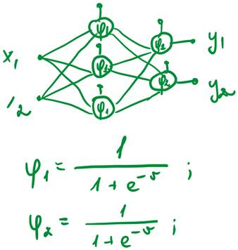
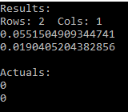

# IS-EX
Exam

To complete this exercise I modified my Laboratory works 2 code.

This is the results I have gotten from a random example I made up. Made this to prove that the neural network code executes.

